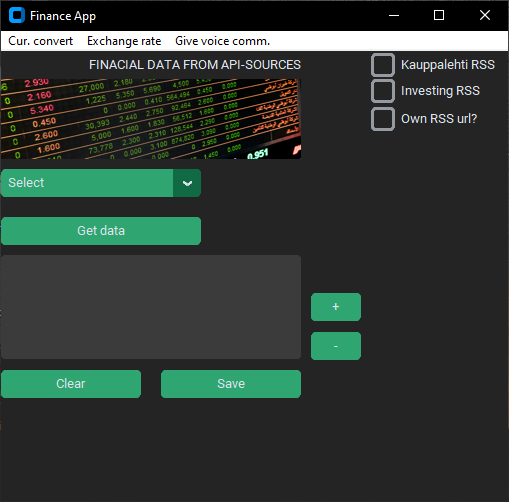
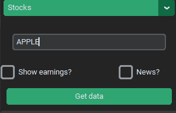

Project keywords: CustomTkinter, REST-API, NoSQL, Mongo Cloud Atlas

DOCUMENTATION IS UNDER CONSTRUCTION. 

ABOUT THE APPLICATION

The idea behind the application is to provide the user with various financial information such as information on stocks, 
commodities and precious metals that the user is looking for. Depending on the user's choices, the application uses 
REST API interfaces (e.g. API-Ninjat, Newsapi) or RSS sources to search for information.

Communication between the REST API and the application takes place using Python's Requests library.
API results are received in json format, which are parsed into a readable format and displayed in the
application's textbox component. The Feedparser library is used for retrieving and parsing RSS feeds.

The user interface is implemented with the customTkinter library and it is possible to store the retrieved
data in the NoSQL cloud database used by the application. The cloud database is located in the Mongo Cloud Atlas service.

Example image of the application's start view

CREDENTIAL SECURITY

All credentials used by the application, such as API keys, database usernames and passwords, are stored in a Python
environment variable. The environment variable is in Gitignore mode. The application retrieves credentials using the
Python OS library if necessary with the environ.get method.

STOCK & CRYPTO CURRENCY INFORMATION SEARCH

Stock/crypto information is searched using the stock's or crypto trading ID. For example, information on the Apple stock
is retrieved by entering the text AAPL in the input field of the application. The entered text is passed as a parameter to
the method that communicates with the REST API and retrieves the data using the Requests library. Finally, the result is 
displayed as parsed in the Customtinter textbox component. When searching for stock information, the user can also select
the "show earnings" check box. By clicking on that check box, the user sees not only the share information but also
the share's estimated earnings information.

FIND NEWS BY STOCK / CRYPTO / COMMODITY NAME

The application user can also search for the latest news based on the name of the stock, cryptocurrency or commodity of her choice by clicking on the "News" checkbox. This feature uses the Newsapi.org API to which the user-supplied keyword is passed as a parameter.

example picture

SEARCH RSS FEEDS

The application has 3 checkboxes for RSS feeds, Kauppalehti RSS, Investing RSS and a custom RSS url.
By clicking the Kauppalehti RSS or Investing RSS check box, the program retrieves the RSS feed of the
selected service using the Feedparser library, parses the result into XML tags and displays the feed 
in text form in the application's text field component. By clicking the checkbox of the custom URL address, 
the program creates an input field where the user can enter his own address, from which the RSS feed is retrieved.

CREATING GRAPHICS FROM SEARCHED VALUES

The application uses the Matplotlib library to create graphs of, for example, stock prices searched by the user.
A finished chart containing the name of a stock, cryptocurrency or commodity and its current value as a bar chart.

CURRENCY CONVERT

This function opens a new window with input fields currencies to be exchanged (use currency codes, e.g. GBP-AUD) and amount of currency to be exchanged. After the user has filled in the selected fields, the values ​​are sent to the Currency Conversion API.