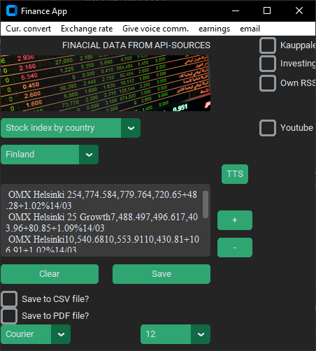
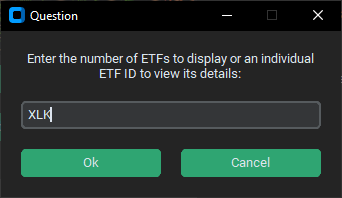
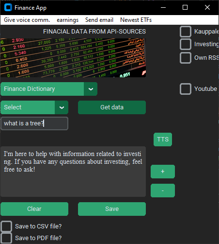

Project keywords: CustomTkinter, REST-API, Cloud-based NoSQL, Data processing, Mailtrap e-mail integration,
Web-Scraping, Beautiful Soup 4, Pandas, OpenAI

ABOUT THE APPLICATION

The idea behind the application is to provide the user with various financial information such as information on stocks, 
commodities and precious metals that the user is looking for. Depending on the user's choices, the application uses 
REST API interfaces (e.g. API-Ninjat, Newsapi), Web-Scraping (Beautiful Soup 4 & request -libraries) and RSS sources to search for information.

Communication between the REST API and the application takes place using Python's Requests library.
API results are received in json format, which are parsed into a readable format and displayed in the
application's textbox component. The Feedparser library is used for retrieving and parsing RSS feeds.

The user interface is implemented with the customTkinter library and it is possible to store the retrieved
data in the NoSQL cloud database used by the application. The cloud database is located in the Mongo Cloud Atlas service.

Example image of the application's start view

CREDENTIAL SECURITY

All credentials used by the application, such as API keys, database usernames and passwords, are stored in a Python
environment variable. The environment variable is in Gitignore mode. The application retrieves credentials using the
Python OS library if necessary with the environ.get method.

VOICE COMMANDS

The user can control some of the application's functions with their own speech.
The application uses a library called SpeechRecognition and the device's microphone when listening to commands given by the user. For now these voice commands are available:

CLEAR = Clears the application's text box

STOCKS = Create an input field and two checkboxes in the user interface. The user needs them when looking for information about stocks

CRYPTO= Create an input field in the user interface. The user can use this input field when searching for information about cryptocurrencies.

STOCK INFO = Retrieves data from the API based on the trading ID of the stock entered by the user

SAVE = Saves the contents of the application's text box to the MongoDB cloud database used by the application

DATA STORAGE OPTIONS (Database,CSV,PDF)

All data retrieved from the API can be stored in a cloud-based Mongo NoSQL database or in a local csv/Pdf file. The user can choose which method to use. When using the database option, the application connects to the Mongo Cloud atlas using the MongoClient and ServerAPI classes. In the CSV file option, the application uses Panda Dataframe methods to save the data to the file. When using the csv saving method, the application uses the customTkinter file window, where the user can choose the name of the file and the storage location.

In the PDF option, the file is created using the Python reportlab library. The user can select the font they want to use for the text saved in the PDF file from the drop-down menu. Currently available fonts are Courier, Times New Roman, and Helvetica. The default font is Courier and is used for text unless the user changes the font. You can also change the font size between 12-20 pixels.

FORWARDING SAVED DATA BY E-MAIL

The user can forward the saved pdf file by e-mail. The application uses the Python Mailtrap client to send emails.

EMAIL VALIDATION

Before sending the email, the program checks that the entered email address is in the correct format. Validation is done with the API-NINJAS Validate Email API. When the user leaves the email field, the program executes a method that sends the entered email address to the Validate Email API. If the API check passes, the send button is enabled. Otherwise, the send button is disabled.

STOCK & CRYPTO CURRENCY INFORMATION SEARCH

Stock/crypto information is searched using the stock's or crypto trading ID. For example, information on the Apple stock
is retrieved by entering the text AAPL in the input field of the application. The entered text is passed as a parameter to
the method that communicates with the REST API and retrieves the data using the Requests library. Finally, the result is 
displayed as parsed in the Customtinter textbox component. When searching for stock information, the user can also select
the "show earnings" check box. By clicking on that check box, the user sees not only the share information but also
the share's estimated earnings information.

FIND NEWS BY STOCK / CRYPTO / COMMODITY NAME

The application user can also search for the latest news based on the name of the stock, cryptocurrency or commodity of her choice by clicking on the "News" checkbox. This feature uses the Newsapi.org API to which the user-supplied keyword is passed as a parameter.

Example image where a user searches for news from NewsAPI using a Microsoft keyword. The program displays the news in relevant order using the 'relevancy' parameter in the API call sent to NewsApi.

SEARCH FINANCIAL DATA USING WEB SCRAPING

The app uses Beautiful Soup 4 and requests libraries to retrieve stock index data from external websites.
Data is retrieved from, for example, HTML table elements using the class name or id value of the table element.
The retrieved data is looped through with a for loop and finally displayed without HTML tags in the application's text box component. 

The Beautiful Soup 4 web scraping library also retrieves the analyst consensus and target price estimate for a stock when a user searches for stock information. This functionality retrieves other stock information from the API-Ninja Stock Price API, as well as the consensus and target price estimate from an external website using Beautiful Soup 4.

Example image where a user has scraped OMXH index data from an external website.

SEARCH ETF DATA

For now, ETF data retrieval is done using the Beautiful Soup web scraping library. The user can search for information about an individual ETF by entering its symbol or a list of available ETFs from around the world. When searching for a list of available ETFs, the app will ask the user to enter the number of ETFs to search for. This is because the list of all ETFs contains several hundred funds and searching for them can be time-consuming and resource-intensive. Entering the number avoids accidentally searching the entire list. 

Python's Isdigit function recognizes user input. ETF trading codes contain only letters and when entering the number of funds to search, only a number is entered. Isdigit returns a True/False boolean and both values ​​have their own functions to execute.

Example image of an input window where a user searches for an individual ETF based on the fund's trading symbol

SEARCH RSS FEEDS

The application has 3 checkboxes for RSS feeds, Kauppalehti RSS, Investing RSS and a custom RSS url.
By clicking the Kauppalehti RSS or Investing RSS check box, the program retrieves the RSS feed of the
selected service using the Feedparser library, parses the result into XML tags and displays the feed 
in text form in the application's text field component. By clicking the checkbox of the custom URL address, 
the program creates an input field where the user can enter his own address, from which the RSS feed is retrieved.

TEXT TO SPEECH

All data in the text box component can be converted to speech. The application uses OpenAI's text-to-speech module to convert text. After conversion, the TTS method creates an mp3 file in the root folder of the application. The file contains the data that was in the textbox component, converted to speech.

LISTENING TO FINANCE PODCASTS

The user can select a finance podcasts to listen to from the drop-down menu. After selection, a link to the podcast's mp3 file is passed to the VLC media player object, which plays the podcast.

CREATING GRAPHICS FROM SEARCHED VALUES

The application uses the Matplotlib library to create graphs of, for example, stock prices searched by the user.
A finished chart containing the name of a stock, cryptocurrency or commodity and its current value as a bar chart.

The user can also create more complex stock value charts. This figure shows the next three estimated EPS numbers for Apple stock. The EPS numbers are taken from the API's JSON response and stored in a Python list.
The Matplotlib library draws the figure based on the list values. List values ​​are sorted from smallest to largest using the Python List Sort method.

Another example where the user has retrieved Microsoft stock data (opening price, lowest price, highest price, and closing price) from the MarketStack API and the program visualizes the data in a vertical bar chart.

HISTORICAL STOCK DATA

The user can search for historical data for the stocks of their choice. The application has input fields for the stock's trading ID and the dates between which data is to be searched. The values ​​entered by the user are passed to the MarketStack API, which returns historical data in JSON format as a response. The from date and to date fields have a method bound to them that creates a calendar object when the user clicks on the fields with the left mouse button.

Example image where the calendar method was executed after a user clicked the mouse

Example image of a user searching for historical data on Microsoft stock between January 7th and January 10th.

FINANCE DICTIONARY

This feature includes common investment words such as p/e ratio, eps ratio, etc.
The feature is used by selecting the desired word from the drop-down menu for which you want an explanation. The explanations corresponding to the word are stored in the cloud-based NoSQL database used by the program and are retrieved according to the user's selections.

Example image where the user has searched the database for an explanation of the term P/E

The user can also ask their own investment question via the chat GPT API. The API is limited to answering ONLY questions related to investments. The restriction is made using a system message variable.

Below is an example of what the API responds with if the user asks something unrelated to investing.

KEYBOARD HOTKEYS

The app has a few keyboard shortcuts for different functions. For example, Control+s opens Python's VLC media player module and plays the mp.3 file recorded by the app as text-to-speech, if the user has previously used the app's text-to-speech feature. The binding between the application and the keyboard combinations is done with the Tkinter bind function